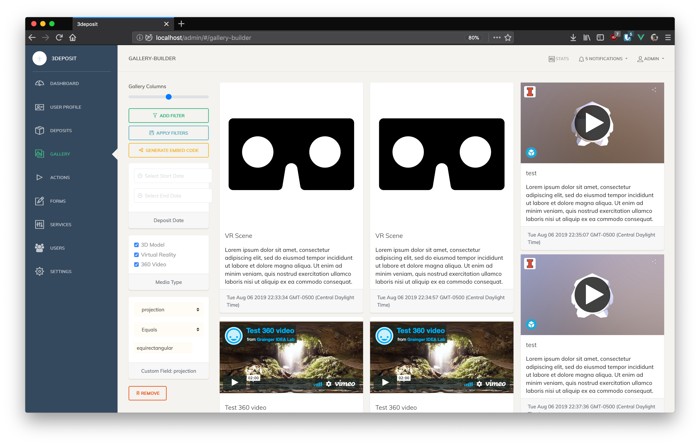

  

3deposit is a 3D-content storage, publication, distribution, & management platform for academic libraries. Key features include a customizable deposit form, automated deposit metadata harvesting, batch deposits, configurable publication endpoints, file integrity checking, and a content 'gallery builder'. 3deposit aims to be extensible, portable, & compatible with existing content preservation systems. Ongoing support and features are planned, including federated content sharing between deployed instances. 



### Storage
By default, 3deposit uses [Minio](https://github.com/minio/minio) for object storage. Instances can be configured to store objects locally or in a remote bucket. Remote buckets can be self-hosted with a MinIO server or with S3-compatbile providers, such as AWS. 

### Publication
3deposit natively supports three media types:
* 3D models 
* 360 videos
* Virtual Reality applications

Type          | Endpoint
------------- | -------------
3D models     | Sketchfab
360 videos    | Vimeo
VR*           | AWS S3

*Properly configured WebVR applications will be published to static hosting.

Custom services can be added to support additional media types & endpoints.

### Deployment
3deposit can be deployed with docker, using the docker-compose file found in the repo.
```
git clone https://github.com/Grainger-Engineering-Library/3deposit.git
cd 3deposit

docker-compose up --build
```

### System


_____

### Acknowledgements
3deposit was developed in Grainger Engineering Library's IDEA Lab, as part of the [Mellon Foundation Immersive Scholar grant](https://www.immersivescholar.org/). In addition to members of the grant cohort, the developers wish to thank the input and guidance from many others at the U of I, including:

* Undergraduate Library
* Media Commons
* CITL
* Library IT
* Engineering IT
* Research Data Services
* School of Information Sciences
* College of Engineering
* Carle Illinois College of Medicine
